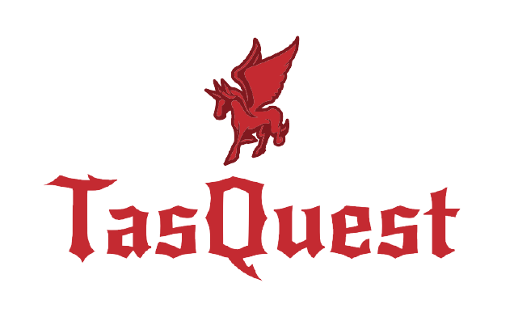

## What is it?

***

TasQuest is a project that will bring gamification to developers tasks, the objective
is to integrate services like Jira, Slack, Confluence, Git and give XP points for completed tasks,
colleagues helped, questions answered, commits approved and so on. 

## Status

It's a personal project, i have no idea if it will become a product or not, i'm doing 
it on my free time to study GoLang and ReasonML.

## How to Run

I shall update this when there are things to run :)